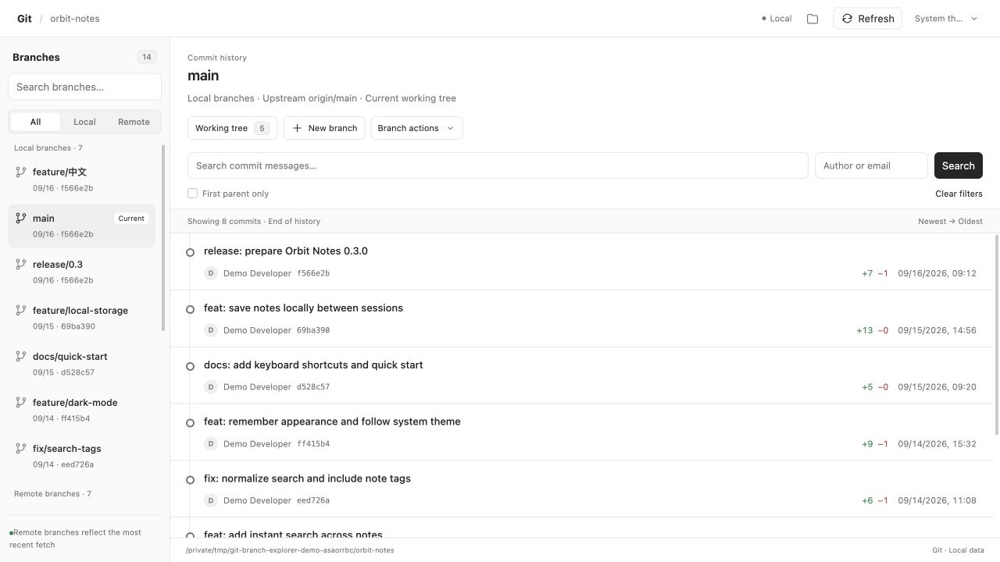
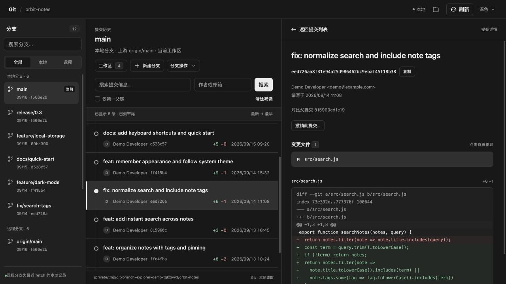
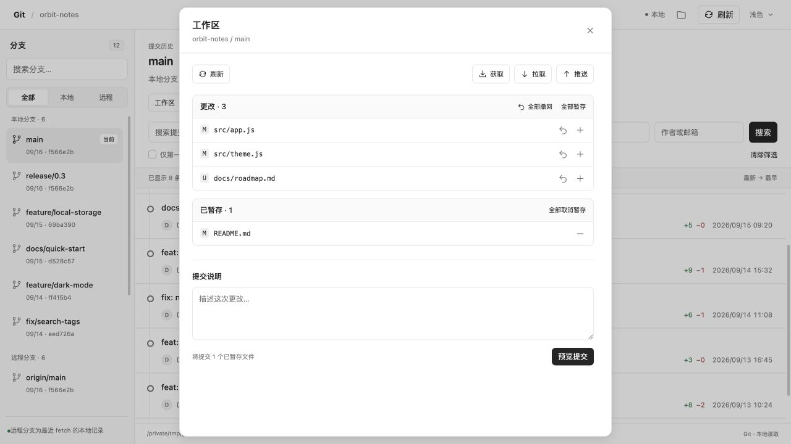
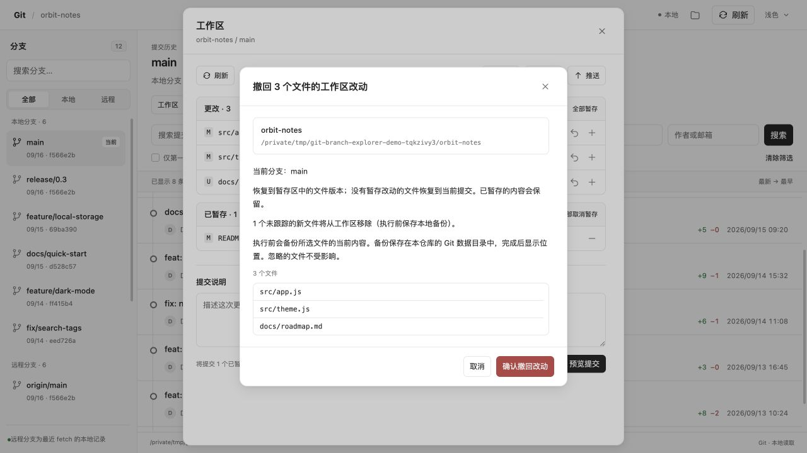

# Git Branch Explorer

**English** · [简体中文](README.zh-CN.md)

Browse Git branches, commit history and file diffs in the Codex right panel. Manage your working tree and branches with a preview before every change.

[Download](https://github.com/Winlifes/codex-git-branch-explorer/releases/latest) · [Report an issue](https://github.com/Winlifes/codex-git-branch-explorer/issues) · [MIT License](LICENSE)



*Real captures from the disposable `orbit-notes` repository in a local MCP development host, without the surrounding Codex window. The history screenshots show v0.3.0 in English and Chinese; the other examples show v0.2.1. The panel now follows the Codex language automatically.*

This is an independently developed, third-party plugin distributed through this repository. It is not currently listed in the official OpenAI plugin directory. Installation does not modify the Codex application.

[Features](#features) · [Install](#install) · [Screenshots](#screenshots) · [How operations work](#how-operations-work) · [Compatibility](#compatibility) · [Development](#development)

## Features

| Area | What you can do |
| --- | --- |
| Branches | Browse local and remote-tracking branches, identify the current branch and see upstream ahead/behind status. |
| History | Browse each branch's commits with pagination, search by message or author, and filter to the first-parent history. |
| Commit details | See the full message, author, SHA, date and time, added/deleted line counts, changed files and per-file diffs. Choose a parent for merge commit diffs. |
| Working tree | Inspect staged and unstaged changes; stage or unstage one file or all files; commit the staged changes. |
| Discard changes | Discard one file's or all files' unstaged changes while preserving the index. Local backups are created before discarding. |
| Branch operations | Create, switch and merge branches; revert commits with a new reverse commit; delete merged local branches. |
| Remotes and conflicts | Fetch, pull with fast-forward only, push without force and set an upstream. Stage resolved conflicts, then continue or abort a merge/revert. |
| Appearance | Follow the Codex theme or select light/dark mode, with themed menus, thin scrollbars and a branch drawer for narrow panels. |
| Language | Follow the Codex language with English and Simplified Chinese UI, including menus, previews, errors, dates and number formatting. Live changes preserve drafts and selections. |

Selecting a branch changes the history you are browsing; it does not check it out. **Refresh** rereads local Git data; use **Fetch** to update remote-tracking branches.

## Install

### Requirements

- Git and Python **3.9+**.
- Codex Desktop with support for **MCP thread entrypoints**. Validated on macOS with the desktop-bundled Codex CLI `0.154.0-alpha.6.2`; other versions and platforms have not been verified.

No third-party Python packages, npm, API key or developer-hosted cloud service are required.

### From this repository

```sh
git clone https://github.com/Winlifes/codex-git-branch-explorer.git
cd codex-git-branch-explorer
python3 scripts/install.py
```

Alternatively, download and extract a ZIP from [Releases](https://github.com/Winlifes/codex-git-branch-explorer/releases/latest), then run `python3 scripts/install.py` from the extracted plugin directory.

The installer copies the plugin to `~/plugins/git-branch-explorer`, configures the local MCP launch path, registers it in your personal plugin marketplace and runs `codex plugin add`. If it cannot find the Codex CLI, it prints the command to run manually.

### Open the panel

1. Open an existing or new Codex task for your Git project.
2. Open the right panel, click **＋**, then select **Git**. Hosts that provide a language during tool discovery may label it **Git Branches** or **Git 分支**.
3. Select a branch to browse its history. Open **Working tree** to inspect and manage local changes.

If the entry is missing after installation, let running tasks finish, quit and reopen Codex, then return to your task. Existing tasks are supported; there is no need to recreate them.

The plugin uses the current task's project directory when available, including its worktree. A new task may not expose that directory before its first message. The panel then displays message/context checks: send a message, close and reopen the Git panel, or choose a repository manually. Once the project directory is available, the panel checks it for Git repositories and shows any specific error.

### Language

The panel uses the language supplied by Codex. English locales use English UI; Chinese locales use Simplified Chinese UI. Other languages currently fall back to English. If the host does not supply a locale, the panel uses the host's HTML language or the browser language.

When Codex sends a language change, open menus, error messages and confirmation previews update in place. Commit drafts, form values and selections stay intact; switching language does not repeat Git requests. Branch names, commit messages, authors, paths and file contents remain exactly as stored in Git. Dates and numbers follow the selected locale, with times shown in the local time zone.

The native tab label is controlled and may be cached by Codex. After installing an update, close and reopen the Git panel to load its new UI.

### Existing installations

Updates are manual. The installer stops if `~/plugins/git-branch-explorer` already exists and is different from the installation source, so running it from another checkout does not overwrite your files. The current developer update workflow is described in [Architecture: validation and updates (Chinese)](docs/architecture.md#验证与更新).

## Screenshots

### Commit details in dark mode

Inspect the commit metadata and changed files alongside a text diff. Commit rows show added and deleted line counts and the local date/time; the time tooltip includes seconds and the time zone.



<details>
<summary><strong>Working tree: staged and unstaged files</strong></summary>

Stage or unstage individual files, use the bulk actions, and write a message to preview a commit. Only staged content is committed.



</details>

<details>
<summary><strong>Discard preview: review the exact affected files</strong></summary>

The confirmation lists the repository, current branch and affected paths. Staged changes are preserved, and current file contents are backed up before the discard runs.



</details>

## How operations work

Every write operation first shows a concrete preview. Confirmation tokens expire after five minutes, and the plugin rechecks the repository state before execution. If the state changes, generate and confirm a new preview.

- **Commits** include only staged changes. Git uses your existing identity, credentials, hooks and signing configuration.
- **Discard** applies to unstaged changes. Partially staged files are restored to their index version. To discard staged edits, unstage them first.
- **Untracked files** are backed up, then removed only at the exact paths listed in the preview. Ignored files are excluded; submodules, nested repositories and conflicted paths require separate handling.
- **Switch, merge, pull and revert** require a clean working tree. Pull is fast-forward only; branch deletion is limited to local branches merged into the current branch.
- **Revert** creates a reverse commit and preserves history. Hard reset, force push, force deletion and remote branch deletion are not available.

Discard backups are stored under `codex-git-explorer/discard-backups/` inside the worktree's Git metadata directory. The result shows the actual location. Each backup's `manifest.json` maps original paths, file modes and symlink targets to the saved data. Backups are retained for manual recovery; they are not deleted automatically.

## Compatibility

- The native panel entry and automatic project lookup depend on the Codex client's MCP entrypoint support and local metadata formats. These may vary between versions. A manual repository picker is available when project context cannot be resolved.
- There is currently no application-level keyboard shortcut for opening this plugin panel.
- Worktrees, repository subdirectories, empty repositories and detached HEAD are supported. Bare repositories are read-only.
- Remote-tracking branches reflect the last fetch. Shallow clones expose only locally available history.
- Binary files show a diff notice. Renames appear as deletion/addition, and individual text diffs larger than 800 KB are truncated with a notice.
- Git operations that need interactive authentication or signing may need to be completed in a terminal. After an operation timeout, refresh to inspect the state before attempting another operation.

## Data and privacy

Git runs locally. Repository queries and project metadata are passed to the Codex host and panel through MCP. The plugin has no maintainer-operated data service, telemetry or analytics. Confirmed remote operations use your repository's configured Git remotes; Git hooks and credential helpers follow your local configuration. See [Privacy](PRIVACY.md) for details.

## Development

Run the test suite and build a portable release archive:

```sh
python3 -m unittest discover -s tests -v
python3 scripts/build_release.py
```

Write-operation tests use disposable repositories and local bare remotes. The build creates a ZIP and SHA-256 checksum in `dist/`, including both READMEs and the screenshots. Git history and local installation configuration are excluded.

A standalone, read-only browser mode is also available for debugging:

```sh
python3 scripts/git_explorer.py start --repo "/path/to/your/repository"
```

It prints a temporary localhost URL. Git write controls require the MCP panel environment.

## Documentation and support

- [Chinese README](README.zh-CN.md)
- [Architecture, implementation and detailed limitations (Chinese)](docs/architecture.md)
- [Privacy](PRIVACY.md)
- [Changelog](CHANGELOG.md)
- [OpenAI directory review preparation](docs/openai-submission.md)
- [Screenshot capture notes](docs/screenshots/README.md)
- [Report a bug or request a feature](https://github.com/Winlifes/codex-git-branch-explorer/issues)

When reporting a problem, include your operating system, Codex version and steps using a shareable example. Keep credentials, private source code and sensitive paths out of public issues.

## License

[MIT](LICENSE) · Copyright (c) 2026 Winlifes.
