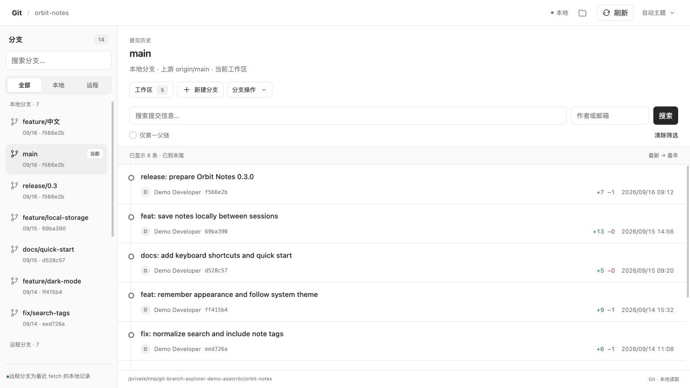

# Git 分支浏览器

[English](README.md) · **简体中文**

在 Codex 右侧面板查看 Git 分支、提交历史和文件差异。直接管理工作区与分支，每次修改前先预览、再确认。

[下载安装包](https://github.com/Winlifes/codex-git-branch-explorer/releases/latest) · [反馈问题](https://github.com/Winlifes/codex-git-branch-explorer/issues) · [MIT 许可证](LICENSE)



*截图来自本地 MCP 开发宿主中的真实运行，使用临时演示仓库 `orbit-notes`，未包含 Codex 窗口外框。历史页面截图为 v0.3.0 的中英文界面，其他示例为 v0.2.1。面板现在会自动跟随 Codex 语言。*

这是独立开发的第三方插件，目前通过本仓库分发，尚未上架 OpenAI 官方插件目录。安装无需修改 Codex 本体。

[功能](#功能) · [安装](#安装) · [运行截图](#运行截图) · [操作说明](#操作说明) · [兼容性](#兼容性) · [开发](#开发)

## 功能

| 场景 | 支持的功能 |
| --- | --- |
| 分支浏览 | 查看本地与远程跟踪分支、当前分支，以及相对上游领先或落后的提交数量。 |
| 提交历史 | 分页浏览每个分支的提交，按提交信息或作者搜索，筛选仅第一父链历史。 |
| 提交详情 | 查看完整提交信息、作者、SHA、具体日期时间、增删行数、变更文件和逐文件差异；合并提交可选择父提交。 |
| 工作区 | 查看已暂存与未暂存改动；单文件或批量暂存、取消暂存；提交暂存区内容。 |
| 撤回改动 | 撤回单文件或全部未暂存改动，保留暂存区内容；执行前保存本地备份。 |
| 分支操作 | 创建、切换和合并分支；通过反向提交撤销提交；删除已合并的本地分支。 |
| 远程与冲突 | 获取更新、快进拉取、普通推送并设置上游；冲突解决后暂存，再继续或中止合并、撤销。 |
| 主题与布局 | 跟随 Codex 主题或手动切换浅色、深色；统一菜单、细滚动条，以及窄面板中的分支抽屉。 |
| 界面语言 | 跟随 Codex 切换英文与简体中文，覆盖菜单、预览、错误提示、日期和数字格式；实时切换保留草稿与选项。 |

选择分支只改变正在浏览的历史，不会切换工作区分支。**刷新**只重新读取本地 Git 数据；需要更新远程跟踪分支时，请使用**获取**。

## 安装

### 环境要求

- Git 和 Python **3.9+**。
- 支持 **MCP thread entrypoints** 的 Codex 桌面客户端。已在 macOS、客户端附带 CLI `0.154.0-alpha.6.2` 上验证；其他版本与平台尚未完成兼容验证。

无需第三方 Python 包、npm、API Key 或开发者运营的云端服务。

### 从仓库安装

```sh
git clone https://github.com/Winlifes/codex-git-branch-explorer.git
cd codex-git-branch-explorer
python3 scripts/install.py
```

也可以从 [Releases](https://github.com/Winlifes/codex-git-branch-explorer/releases/latest) 下载并解压 ZIP，在解压后的插件目录执行 `python3 scripts/install.py`。

安装器将插件复制到 `~/plugins/git-branch-explorer`，配置本机 MCP 启动路径，注册到个人插件市场，再运行 `codex plugin add`。如果找不到 Codex CLI，会显示可手动执行的命令。

### 打开面板

1. 在 Codex 中打开 Git 项目的现有任务或新任务。
2. 打开右侧面板，点击 **＋ → Git**。宿主在工具发现时提供语言信息的情况下，入口会显示 **Git 分支**或 **Git Branches**。
3. 选择分支浏览历史；点击**工作区**查看和管理本地改动。

如果安装后入口没有出现，请等正在运行的任务完成，退出并重新打开 Codex，再回到原任务。旧任务同样支持，无需重新创建。

插件在能够取得项目目录时，自动打开当前任务对应的仓库，包括任务使用的 worktree。新任务尚未发送首条消息时，客户端可能还没有提供目录。面板会显示消息与项目上下文检查提示：发送消息后关闭并重新打开 Git 面板，或手动选择仓库。取得项目目录后，面板会检查其中的 Git 仓库，并显示具体错误。

### 界面语言

面板优先使用 Codex 传入的语言。英文语言区域显示英文，中文语言区域显示简体中文，其他语言暂时回退为英文。宿主没有提供语言信息时，使用宿主页面的 HTML 语言或浏览器语言。

收到 Codex 的语言变化后，已打开的菜单、错误提示和确认预览会即时更新；提交草稿、表单内容和选项会保留，不会重复发送 Git 请求。分支名、提交信息、作者、路径与文件内容保持 Git 中的原文。日期与数字按当前语言区域格式显示，时间采用本地时区。

原生标签页名称由 Codex 控制，可能被客户端缓存。安装更新后，关闭并重新打开 Git 面板即可加载新版界面。

### 已安装用户

当前需要手动更新。若 `~/plugins/git-branch-explorer` 已存在，且与安装来源不同，安装器会停止，避免从另一个目录安装时覆盖现有文件。当前开发者更新流程见[实现文档：验证与更新](docs/architecture.md#验证与更新)。

## 运行截图

### 深色主题下的提交详情

同时查看提交信息、变更文件与文本差异。提交列表显示增删行数和本地日期时间；悬停时间可查看秒与时区。


<details>
<summary><strong>工作区：已暂存与未暂存文件</strong></summary>

按文件或批量暂存、取消暂存，填写提交说明后预览提交。提交只包含暂存区中的内容。


</details>

<details>
<summary><strong>撤回预览：核对受影响的具体文件</strong></summary>

确认页列出仓库、当前分支和受影响路径。已暂存的改动会保留，撤回前会备份文件的当前内容。


</details>

## 操作说明

每次写操作先显示具体预览。确认凭据有效期为五分钟，执行前会重新核对仓库状态。如果状态发生变化，需要重新生成预览并确认。

- **提交**只包含已暂存内容，使用现有 Git 身份、凭据、钩子和签名配置。
- **撤回改动**只影响未暂存内容。部分暂存的文件恢复到暂存区版本；若要撤回已暂存改动，请先取消暂存。
- **未跟踪文件**先备份，再按预览列出的精确路径移除。忽略文件不参与撤回；子模块、嵌套仓库和冲突路径需要单独处理。
- **切换、合并、拉取和撤销提交**要求工作区没有未提交改动。拉取仅允许快进；删除仅针对已合并到当前分支的本地分支。
- **撤销提交**通过生成反向提交保留历史。暂不提供硬重置、强制推送、强制删除或删除远程分支。

撤回备份保存在该工作树 Git 数据目录下的 `codex-git-explorer/discard-backups/`，操作结果会显示实际位置。每份备份中的 `manifest.json` 对应原路径、文件模式、符号链接目标与保存的数据。备份会保留供手动恢复，不会自动删除。

## 兼容性

- 原生面板入口和自动项目识别依赖 Codex 客户端的 MCP 入口支持与本地元数据格式，不同版本可能有差异。无法识别项目时，可以手动选择仓库。
- 当前没有用于打开此插件面板的应用级快捷键。
- 支持 worktree、仓库子目录、空仓库和 detached HEAD；裸仓库仅支持浏览。
- 远程跟踪分支反映最近一次获取的记录；浅克隆只显示本地已有历史。
- 二进制文件显示差异提示；重命名按删除与新增展示；单文件文本差异超过 800 KB 时会提示截断。
- 需要交互式认证或签名的 Git 操作，可能需要先在终端处理。操作超时后，请刷新查看状态，再决定是否重新执行。

## 数据与隐私

Git 在本机运行，仓库查询结果和项目元数据通过 MCP 传给 Codex 宿主与面板。插件没有维护者运营的数据服务、遥测或分析追踪。经确认的远程操作使用仓库已配置的 Git 远程；Git 钩子和凭据辅助程序遵循本机配置。详见[数据与隐私](PRIVACY.md)。

## 开发

运行测试并构建可分发安装包：

```sh
python3 -m unittest discover -s tests -v
python3 scripts/build_release.py
```

写操作测试使用临时仓库与本机裸远程。构建后在 `dist/` 生成 ZIP 和 SHA-256 校验文件，包含中英文 README 与截图，不包含 Git 历史或本机安装配置。

也可启动独立的只读浏览器模式用于调试：

```sh
python3 scripts/git_explorer.py start --repo "/path/to/your/repository"
```

命令会输出临时本地访问地址。Git 写操作控件需要在 MCP 面板环境中使用。

## 文档与支持

- [英文 README](README.md)
- [架构、实现与详细限制](docs/architecture.md)
- [数据与隐私](PRIVACY.md)
- [发布记录](CHANGELOG.md)
- [OpenAI 上架准备与复现场景（英文）](docs/openai-submission.md)
- [截图来源说明](docs/screenshots/README.md)
- [反馈问题或提出功能建议](https://github.com/Winlifes/codex-git-branch-explorer/issues)

反馈时请提供操作系统、Codex 版本，以及可分享示例的复现步骤。请勿在公开 Issue 中附上凭据、私有源码或敏感路径。

## 许可证

[MIT](LICENSE) · Copyright (c) 2026 Winlifes。
